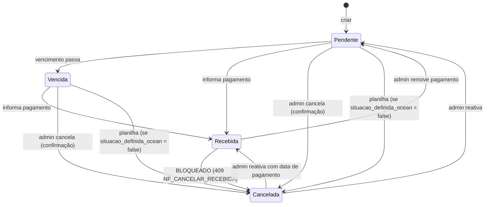

# Data Model: Status "Cancelada" em Contas a Receber

**Feature**: `078-contas-receber-cancelada` | **Data**: 2026-10-01 | Decisões em [research.md](./research.md)

## Entidades afetadas

### Conta a Receber (`nfs`, model `NF`)

| Campo | Tipo | Mudança | Regra |
|---|---|---|---|
| `status` | enum `StatusNF` (`paga`, `pendente`, `vencida`, `cancelada`) | Sem mudança de tipo | `cancelada` passa a poder ser definido pelo `admin` (D1) e tem precedência sobre o cálculo automático (D2) |
| `situacao_definida_ocean` | `BOOLEAN NOT NULL DEFAULT FALSE` | **Nova** | `TRUE` quando o `admin` cancela ou reativa pelo Ocean; a importação não altera o estado de cancelamento dessas contas (D4) |
| `data_pagamento`, `caixa` | existentes | Sem mudança | Conta cancelada a partir desta feature nunca tem `data_pagamento` (D3) |
| `razao_social` | existente | Comportamento | Importação não sobrescreve com "Cancelada" em contas existentes (D6) |
| `revisar_cancelamento` | booleano **calculado** (não persistido) | **Novo na resposta** | `status = cancelada AND data_pagamento IS NOT NULL` (D7) |

Conta "válida para cálculos": `status != cancelada AND excluida_em IS NULL` (helper `filtro_nf_valida`, D8). Arquivamento segue o comportamento atual de cada tela.

### Comissão / Bônus (`bonus`, model `Bonus`)

| Campo | Tipo | Mudança | Regra |
|---|---|---|---|
| `nf_cancelada` | booleano **calculado** (não persistido) | **Novo na resposta** | `nf_id` preenchido e conta vinculada com `status = cancelada` (D9) |
| `valor_bonus`, `pago`, `liberado` | existentes | Sem mudança | Preservados ao cancelar/reativar a conta (FR-012) |

Comissão "válida para cálculos": `nf_id IS NULL` **ou** conta vinculada válida (helper `filtro_bonus_valido`, D8).

## Situação no formulário × status persistido

| Situação escolhida (`situacao`) | Status resultante | Efeito em `situacao_definida_ocean` |
|---|---|---|
| `cancelada` | `cancelada` | `TRUE` (se o status mudou) |
| `pendente` | calculado por datas: `pendente` ou `vencida` (limpa `data_pagamento`) | `TRUE` se a conta estava `cancelada` |
| `recebida` | `paga` (exige `data_pagamento`) | `TRUE` se a conta estava `cancelada` |
| ausente | conta cancelada: mantém `cancelada`; demais: cálculo atual por datas | sem mudança |

## Transições de estado

Planilha marcando cancelada uma conta Recebida, ou uma conta reativada no Ocean, não muda o estado e gera item em `cancelamentos_ignorados` (D4, D5).

## Validações

| Regra | Origem | Resposta |
|---|---|---|
| Cancelar conta com `status = paga` | FR-015 | 409 `NF_CANCELAR_RECEBIDA` |
| Registrar `data_pagamento` em conta cancelada sem `situacao` de reativação | D2 | 409 `NF_CANCELADA_PAGAMENTO` |
| `situacao = recebida` sem `data_pagamento` | FR-011 | 422 (mensagem atual "Informe a data de pagamento para marcar como recebido.") |
| Alterar situação sendo `visualizador` | FR-002 | 403 (rota já exige `admin`) |

## Migração

- `ALTER TABLE nfs ADD COLUMN IF NOT EXISTS situacao_definida_ocean BOOLEAN NOT NULL DEFAULT FALSE` em `_migrar()` (`backend/app/main.py`).
- Sem migração de dados: canceladas existentes ficam com `situacao_definida_ocean = FALSE` (a planilha continua podendo reativá-las ou cancelá-las até que o `admin` intervenha).
